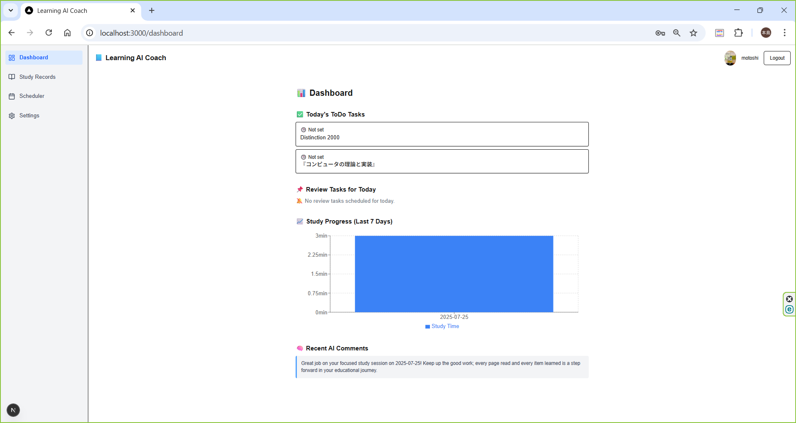
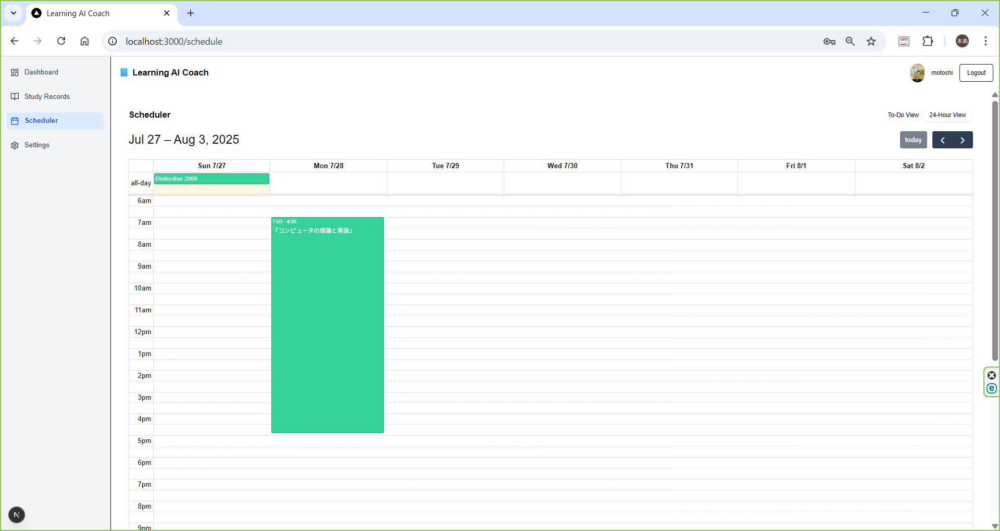
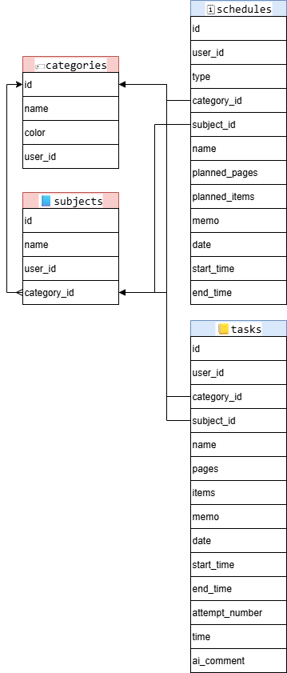

# 📚 Learning AI Coach

An AI-powered learning tracker that helps you log study sessions, visualize progress, and receive personalized feedback.

---

## 🎯 Motivation

I created this app to solve a personal frustration: traditional study trackers often lack motivation-boosting feedback or flexible planning tools. I wanted a solution that not only visualizes learning efforts but also *thinks* with you — suggesting review timing and encouraging insights via AI.

---

## ✨ Features

- 📅 **Flexible Scheduler**: Drag-and-drop support for both 24h view and simple ToDo tasks  
- 🧠 **AI Feedback**: Generates concise advice on your study notes using OpenAI  
- 📈 **Progress Chart**: Visualize study time trends over the past 7 days  
- 🔔 **Review Reminders**: Spaced repetition logic to detect when to review past topics  
- 🌙 **Theme Support**: Light / Dark / System theme switch  
- 🧾 **Tagging System**: Organize by category and subject  

---

## 🛠️ Tech Stack

- **Framework**: Next.js 15 (App Router + Turbopack)  
- **Database**: Supabase (PostgreSQL)  
- **Auth**: Supabase Auth  
- **Storage**: Supabase Storage (via Edge Function)  
- **AI Integration**: OpenAI API  
- **Charts**: Recharts  
- **UI Library**: Tailwind CSS + Radix UI + shadcn/ui  

---

## 📷 Screenshots

| Dashboard | Scheduler (24h View) |
|-----------|----------------------|
|  |  |

---

## 🧩 ER Diagram

The following diagram shows the relationship between core entities such as `users`, `api_keys`, `subjects`, `categories`, and `tasks`.



---

## 🧗 Challenges & Learnings

- 🧩 **Nested SQL Relationships**: Handling hierarchical data (e.g., subject → category) in Supabase required custom SQL views for smoother frontend usage  
- 🔄 **Realtime UI Sync**: Making the scheduler reflect record changes instantly demanded careful state and calendar event handling  
- 🔐 **Secure Key Storage**: Encrypting API keys securely while managing frontend sessions involved significant architectural design with Edge Functions (in progress)  

---

## 📝 TODO / Future Work

- [ ] **Tailwind Migration**: Some components still use legacy styles (as of 2025-07-27)  
- [ ] **Encrypted API Key Storage**: Implementation via Edge Functions pending frontend session fix  
- [ ] **i18n Support**: Currently hardcoded in English; plans to introduce multi-language support  
- [ ] **Mobile Responsiveness**: Some layouts need refinement for smaller screens  
- [ ] **Unit Tests & CI**: Jest + GitHub Actions integration is planned  
- [ ] **Soft Delete Support**: Currently records are physically deleted; consider implementing soft delete with `deleted_at` fields for better auditability and recovery  

---

## 🌐 Live Demo

You can try the app here:  
👉 **https://my-ai-coach-pied.vercel.app/signin**

No login required (Demo mode available).  
Or, sign up and explore more features.

⚠️ **Note on AI usage in demo mode:**

- The **AI comment generation feature** has a shared limit of **100 requests per day** across all demo users.
- If AI responses are not shown, it is likely the daily limit has been reached.
- For stable access and unlimited usage, please create an account and register your own API key in the settings.

💬 **Contact**  
If you encounter issues, feel free to reach out via:  
📧 aquarius0218tm@gmail.com  
or open an issue at 👉 [GitHub Issues](https://github.com/takkuAny/my-ai-coach/issues)

---

## 🚀 Getting Started

Follow these steps to run the project locally:

```bash
# 1. Clone the repository
git clone https://github.com/takkuAny/my-ai-coach.git
cd my-ai-coach

# 2. Install dependencies
npm install

# 3. Set up environment variables
cp .env.example .env.local
# Edit `.env.local` and add:
# - NEXT_PUBLIC_SUPABASE_URL
# - NEXT_PUBLIC_SUPABASE_ANON_KEY
# - OPENAI_API_KEY
# - (optional) ENCRYPTION_SECRET, etc.

# 4. (Optional) Run Supabase locally
npx supabase init
npx supabase start

# 5. Start development server
npm run dev
```
---

## 📄 Full Schema

See [`docs/schema.sql`](./docs/schema.sql) for the full database definition.

---

## 🪪 License

This project is licensed under the MIT License.  
See the [LICENSE](./LICENSE) file for details